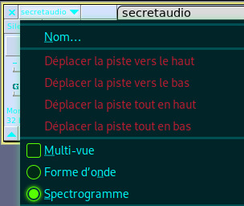

#  Translation & Shifting 
1- Texte modifier

*   “**can you capture the flag?**”

2- Binnaire

*   C'est du binaire “**01101100 01100101 01110100 01110011 00100000 01110100 01110010 01111001 00100000 01110011 01101111 01101101 01100101 00100000 01100010 01101001 01101110 01100001 01110010 01111001 00100000 01101111 01110101 01110100 00100001**”
*   ****
    *   voir Perl : [Binaire to Ascii](#root/2wzjZjf0XVaD/LRzG9s2KSkTT/DbrsAUM6Wvt7/gC8j6hXfE4kr)"
    *   L'option “**\-d**” de la commande “**tr**” est utilisée pour supprimer des caractères spécifiés du flux d'entrée. Voici comment cela fonctionne :

3- Base32

*   C'est du Base32 "**MJQXGZJTGIQGS4ZAON2XAZLSEBRW63LNN5XCA2LOEBBVIRRHOM======**"
*   
    *   “**base32**” : C'est le nom de la commande pour manipuler des données encodées en base32.
    *   “**\-d**” : C'est l'option qui indique à base32 de décoder les données. 

4- Base64

*   C'est du Base64 "**RWFjaCBCYXNlNjQgZGlnaXQgcmVwcmVzZW50cyBleGFjdGx5IDYgYml0cyBvZiBkYXRhLg==**"
*   
    *   “**base64**” : C'est le nom de la commande pour manipuler des données encodées en base64.
    *   “**\-d**” : C'est l'option qui indique à base64 de décoder les données.

5- Hexadecimal

*   C'est de l'hexadécimal “ ”
*    
    *   “**xxd**” : convertit en représentation hexadécimale une donnée binaire et inversement.
    *   “**\-r**” : C'est l'option qui indique à xxd d'effectuer une opération inverse, c'est-à-dire de convertir une représentation hexadécimale en données binaires.
    *   “**\-p**” : C'est l'option qui indique à xxd que l'entrée est au format hexadécimal pur

6- ROT13 (Rotation by 13 places)

*   C'est dur ROT13 “**Ebgngr zr 13 cynprf**”
*   
    *   “**tr**” est un utilitaire Unix/Linux utilisé pour traduire ou supprimer des caractères d'un flux d'entrée pour produire un flux de sortie modifié
    *   “**A-Za-z**'” : Cette partie spécifie les caractères d'entrée qui seront affectés par la traduction.
    *   “**N-ZA-Mn-za-m**” : Cette partie spécifie la manière dont chaque caractère sera traduit. Chaque caractère de la plage 'A-Za-z' sera remplacé par le caractère correspondant dans la plage ce qui effectue un décalage de 13 positions dans l'alphabet.

7- ROT??

*   C'est du ROT on ne connait pas la variable de rotation “**\*@F DA:? >6 C:89E C@F?5 323J C:89E C@F?5 Wcf E:>6DX**”
*   
    *   Toujours avec la commande “**tr**” on vas inclure tout les caractères de la table **ASCII**
    *   “**!-~**” : Cela représente une plage de caractères dans la table **ASCII**, de l'exclamation (**!**) au tilde (**~**). Cela inclut tous les caractères imprimables dans la table **ASCII**.
    *   “**P-~!-O**” : Cela représente une autre plage de caractères dans la table **ASCII**. Cependant, les caractères sont décalés par rapport à la plage précédente. Le caractère '**P**' est le premier caractère de sortie (remplaçant '**!**' dans la plage d'entrée), et '**O**' est le dernier caractère de sortie (remplaçant '**~**' dans la plage d'entrée).

8- Morse

*   C'est du morse :

**\- . .-.. . -.-. --- -- -- ..- -. .. -.-. .- - .. --- -.**

**. -. -.-. --- -.. .. -. --.**

*   il existe un outil sous linux capable de convertir du **morse** en **ASCII** “**morse2ascii**”
*   
    *   cette outil nécessite un fichier “**.txt**”

9-  BCD

*   C'est du "BCD" (Binary Coded Decimal) “**85 110 112 97 99 107 32 116 104 105 115 32 66 67 68**”
*   
    *   **bcd\_values = \[85, 110, 112, 97, 99, 107, 32, 116, 104, 105, 115, 32, 66, 67, 68\]** : Cette ligne définit une liste “**bcd\_values**” contenant les valeurs **BCD** à décoder.
    *   **ascii\_message = ''.join(chr(bcd) for bcd in bcd\_values)** : 
        *   **chr(bcd)** : Convertit chaque valeur **BCD** en son équivalent caractère **ASCII**.
        *   **(chr(bcd) for bcd in bcd\_values)** : Génère une séquence de caractères **ASCII** à partir des valeurs **BCD** de la liste "**bcd\_values**".
        *   **''.join(...)** : Concatène tous les caractères **ASCII** en une seule chaîne de caractères.
        *   **ascii\_message = ...** : Assignation de la chaîne de caractères résultante à la variable “**ascii\_message**”.
*     
     

10- ???

*   C'est du **base64** (On peut le deviné avec le mélange de majuscule/minuscule)
    *   
*   C'est du **morse** :
    *   
*   C'est du **binaire** : 
    *   
        *   " **xargs** " : **xargs** lit des éléments délimités par  des  blancs
        *   “ **\-n 1 ”** : ce paramètre spécifie le nombre d'arguments à utiliser à chaque fois qu'une commande est exécutée “**\-n 1**” traite chaque élément en entrée un par un
        *   “ **< 10-2.txt** ” : indique les données d'entrées
        *   " **perl -lpe** " : appel la commande **Perl**
            *   “ **-l** ” : active le traitement de la ligne automatique. Il supprime les nouvelles lignes des entrées et ajoute automatiquement des nouvelles lignes aux sorties
            *   “ **\-p** ” : active le mode "impression" (**print**). Il lit l'entrée ligne par ligne, exécute le script fourni pour chaque ligne, puis imprime la ligne
            *   “ **\-e** ” : permet d'écrire un script **Perl** directement en ligne de commande
        *   " '**$\_=pack("C", oct("0b$\_"))'** " :
            *   " **pack("C", ...)** " :pack est une fonction **Perl** utilisée pour convertir des données entre différents formats, et "**C**" est un format spécifique utilisé pour traiter les caractères en **ASCII**. En utilisant "**C**" comme format, nous indiquons à **Perl** que nous souhaitons convertir un **nombre entier non signé** en un caractère **ASCII**
            *   " **oct("0b$\_")** " : Cette partie de la commande convertit une valeur binaire en un nombre entier
                *   " **$\_** " : contient la valeur **binaire** en cours de traitement
                *   " **0b** " : préfixe qui indique à **Perl** que la chaîne suivante est en base 2 (**binaire**)
                *   “ **oct()** ”: est une fonction **Perl** qui convertit une chaîne de caractères en un **nombre entier**
            *   “ **$\_=** ” : **variable** spéciale en **Perl** qui est souvent utilisée comme **variable par défaut**
*   C'est du **ROT47** : " **f e   \` \_ \`   \` \` e   b h   \` \` d   b a   \` \_ h   h f   \` \_ f   \` \_ \`   b a   \` \` e   \` \_ c   \` \_ d   \` \` d   b a   h f   b a   h g   \` \_ d   \` \` e   b a   \` \` e   \` \` c   \` \_ d   h h   \` \_ f   \` \_ d   \` \_ \`   \` \` c   c e   c e   c e** "
    *   
*   C'est du **BCD** : “ **7 6   1 0 1   1 1 6   3 9   1 1 5   3 2   1 0 9   9 7   1 0 7   1 0 1   3 2   1 1 6   1 0 4   1 0 5   1 1 5   3 2   9 7   3 2   9 8   1 0 5   1 1 6   3 2   1 1 6   1 1 4   1 0 5   9 9   1 0 7   1 0 5   1 0 1   1 1 4   4 6   4 6   4 6** ”
*   On vas réutilisé notre scripte python “ **BCD.py** ” tout d'abord modifiant légèrement le code d'entrée :
    *   
        *   On supprime les espaces individuel et on ajoute une virgules après chaque nombres  : “ **76, 101, 116, 39, 115, 32, 109, 97, 107, 101, 32, 116, 104, 105, 115, 32, 97, 32, 98, 105, 116, 32, 116, 114, 105, 99, 107, 105, 101, 114, 46, 46, 46,** ”
    *   
        *   On met l'entrée dans la variable “ **bcd\_values** ”
    *   
        *   Let's make this a bit trickier...  
             

Finit !!! 18/03/2024

# Security through obscurity
1- 

*   
    *   Utilisé l'utilitaire “**binwalk**” pour extraire les fichier cachés
        *   “ **binwalk --run-as=root --dd=.\* meme\_1559010886025.jpg** ”
*   
    *   hackerchat.png

2-

*   
    *   Extraire le fichier “ **hackerchat.png** ”
        *   “ **unrar x 122A7** ”
*   
*   

Finit !!! 21/03/2024

# Spectrograms
1- Installer Audacity 

*   

2- Ouvrir le fichier "secretaudio" sur Audacity

*   
    *   Changer la vue en “Spectrogramme”
*   
*   
    *   “Super Secret Message”

Finit !!! 21/01/2024

# Steganography
1- Télécharger l'image

*   

2- Données Exif

*   
    *   Ca ne donne rien

3- Changer le contraste / luminosité de l'image

*   
    *   Ca ne donne rien 

4- **Steghide**

*   
    *   Télécharger “**Steghide**”
*   “ **steghide info .jpg** ”
    *   
        *   on à trouver un fichier .txt caché dans l'image
*   “ **steghide extract -sf .jpg** ” 
    *   
*   “ **cat steganopayload2248.txt**  ”
    *                                                                                                                

Finit !!! 21/03/2024
